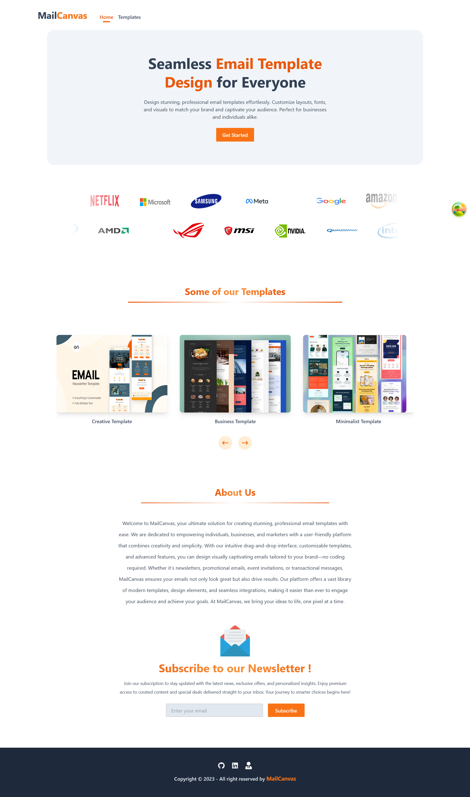

# **MailCanvas- An Email Template Builder app** 

- <a href="https://mailcanvas.netlify.app/" target="_blank">Live Site</a>  

  ## **Table of Contents**

1. [Overview](#overview)  
2. [Objectives](#objectives)  
3. [Technology Used](#technology-used)  
4. [Features](#features)
   - [Templates](#templates)  
   - [Editing Page](#editing_page)
5. [Contact Information](#contact-information)

## **Overview**
  

**MailCanvas** is a dynamic **Email Template Building** application that empowers users to create and customize professional email designs with ease. It offers a variety of pre-designed templates that users can personalize with advanced editing options to suit their branding or communication needs.

### Key Features:
- **Advanced Template Customization:** Allows users to set text color, upload logos and images, and edit sections like title, title description, content, footer, and background using a color picker.
- **User-Friendly Interface:** Intuitive editing tools and a visually rich experience enable users to seamlessly design email templates with minimal technical skills.
  
## **Objectives**

- **Purpose**:  
  **MailCanvas** is built to To simplify the creation of visually appealing, personalized email templates for businesses and individuals, making email marketing and communication accessible to all.

- **Why It’s Good**:  
  - Reduces the dependency on graphic designers or HTML knowledge.
  - Offers flexibility and branding consistency through powerful customization tools.

- **Developer Challenge**:  
  - Ensuring smooth integration of real-time editing features like color pickers and image uploads.
  - Balancing performance and user experience with multiple visual customization options.

 ## **Technology Used**

- **Frontend**: React, Tailwind CSS, TanStack Query  
- **Backend**: Node.js, MongoDB

  
## **Features**

### **Templates Page**  
   
  
- Here you will find some build-in templates for your editing

### **Editing Page**  
  

- Edit text, buttons (with URLs), and background color.
- Add logos and main images seamlessly.
- Customize the title, add small details, and write extended content.
- Adjust footer text, colors, and background.
- Tailor content based on the selected template for consistency.

## **Contact Information**

For queries or collaboration, reach out at:  
**Email**: [ra.rabiulahsan@gmail.com](mailto:ra.rabiulahsan@gmail.com)  
<a href="https://www.linkedin.com/in/rabiul-ahsan" target="_blank">Linkedin</a>  
<a href="https://rabiulahsan.netlify.app/" target="_blank">Portfolio</a>  

